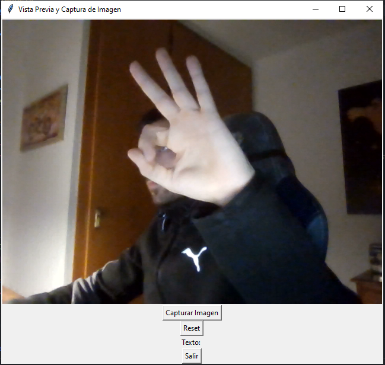

Soy Miguel Ángel Lanau, esta es mi solución al dailyHack del Hackaton de Lleida 2023, HackEPS.
 
refs: https://github.com/FerranAD/dailyhack2023/tree/main

# Descripción
Se ha realizado en python un modelo de reconocimiento de gestos de manos, los cuales son los siguientes:
 
  
|                |                 |
|----------------|-----------------|
| forma de 'C'   |  forma d' 'L'   |
| des de sota    |   'OK'          |
| puny           | palma           |
| puny de perfil | palma de perfil |
| index          | polze           |

Además se ha realizado una traducción de estos gestos a letras, de forma que podamos utilizarlos para escribir en lenguaje natural.
Las traducciones serían las siguientes:

| Signos          | Letra |
|-----------------|-------|
| palm            |       |
| l+l             | a     |
| l+fist          | b     |
| l+thumb         | c     |
| l+ok            | d     |
| l+c             | e     |
| fist+fist       | f     |
| fist+l          | g     |
| fist+thumb      | h     |
| fist+ok         | i     |
| fist+c          | j     |
| thumb+l         | k     |
| thumb+fist      | l     |
| thumb+thumb     | m     |
| thumb+ok        | n     |
| thumb+c         | ñ     |
| ok+l            | o     |
| ok+fist         | p     |
| ok+thumb        | q     |
| ok+ok           | r     |
| ok+c            | s     |
| c+l             | t     |
| c+fist          | u     |
| c+thumb         | v     |
| c+ok            | w     |
| c+c             | x     |
| c+palm          | y     |
| l+palm          | z     |

Por último, se ha realizado una interfaz gráfica que permite introducir a través de la webcam los diferentes signos, y va mostrando el texto generado.
Entre las funciones de la interfaz tendremos la posibilidad de Capturar una imagen, resetear el texto y Salir.

 
